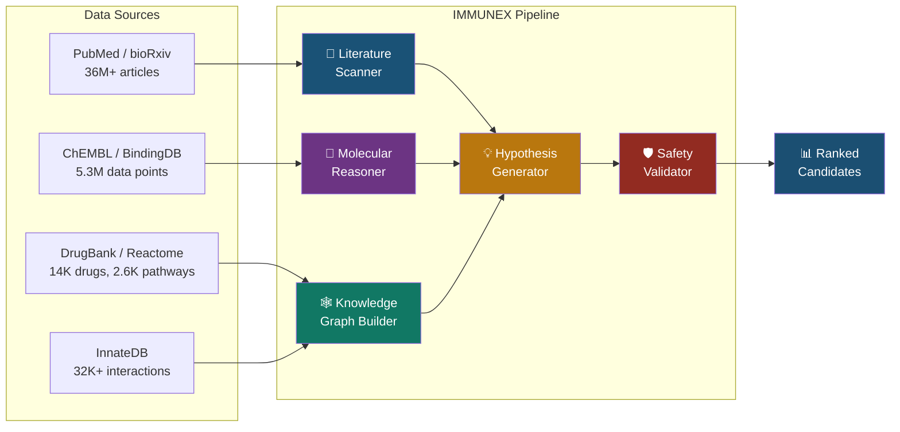
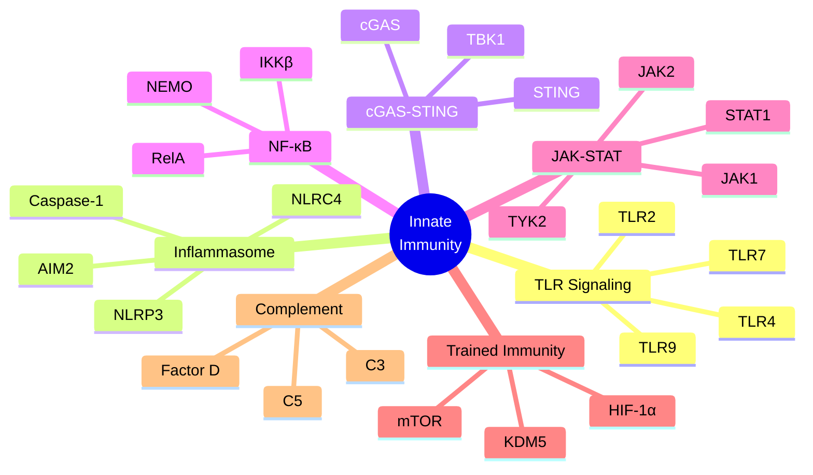
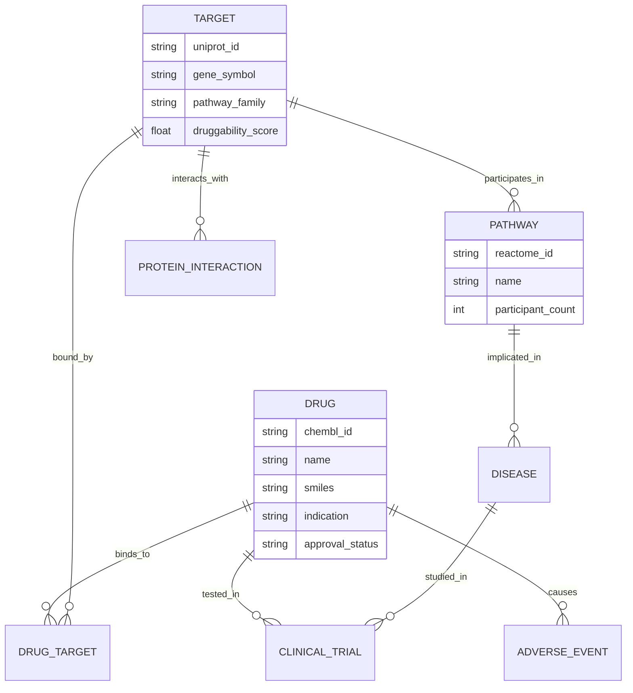

<div align="center">

# 🧬 IMMUNEX

### Autonomous Multi-Agent AI System for Drug Repurposing in Innate Immunity

[](https://www.python.org/downloads/)
[](https://opensource.org/licenses/MIT)
[](https://pubmed.ncbi.nlm.nih.gov/)
[](https://www.ebi.ac.uk/chembl/)

*Systematic identification of approved drugs with untapped potential to modulate innate immune pathways*

[Documentation](docs/ARCHITECTURE.md) · [API Reference](#api-endpoints) · [Data Sources](#data-sources) · [Results](#current-results)

</div>

---

## The Problem

Drug development takes **10-15 years** and costs **$2.6 billion per compound**. Yet **35% of FDA-designated breakthrough therapies are repurposed drugs** - existing molecules applied to new indications.

The innate immune system - our first and fastest line of defense against pathogens, inflammation, and chronic disease - remains one of the most therapeutically underexplored systems in immunology. Hundreds of approved drugs have documented but unstudied effects on innate immune pathways like inflammasomes, cGAS-STING, and trained immunity. These signals are buried across millions of papers, scattered databases, and disconnected clinical observations.

**Nobody is systematically looking. IMMUNEX changes that.**

## Architecture

IMMUNEX is not a single model. It is a coordinated system of five specialized AI agents, each handling a distinct stage of the repurposing pipeline:



### Agent Breakdown

| Agent | Function | Input | Output | Status |
|-------|----------|-------|--------|--------|
| **Literature Scanner** | Mines PubMed for drug-innate immunity associations using LLM-powered NLP extraction | PubMed queries across 7 pathway families | Structured drug-pathway-evidence triples | ✅ Operational |
| **Molecular Reasoner** | GNN-based prediction of drug-target binding affinity for innate immune targets | SMILES structures + protein sequences | Binding probability scores per target | 🔄 Training |
| **Knowledge Graph Builder** | Constructs heterogeneous biomedical graph from 9 data sources; link prediction via TransE/RotatE | Multi-source relational data | Typed graph with 6 node types, 12 edge types | ✅ Operational |
| **Hypothesis Generator** | LLM-based evidence synthesis combining literature, molecular, and graph signals | Multi-agent evidence streams | Ranked hypotheses with confidence tiers (A/B/C) | ✅ Operational |
| **Safety Validator** | Cross-references candidates against FDA FAERS (20M+ adverse event reports) and known interactions | Candidate drugs | Risk-stratified safety profiles | ✅ Operational |

## Innate Immune Target Map

IMMUNEX tracks **24 validated drug targets** across **7 core signaling pathways** of the innate immune system:



| Pathway | Targets | Therapeutic Relevance | Known Repurposing Leads |
|---------|---------|----------------------|------------------------|
| **TLR Signaling** | TLR2, TLR4, TLR7, TLR9 | Pathogen recognition, inflammatory initiation | Imiquimod (TLR7), Eritoran (TLR4) |
| **Inflammasome** | NLRP3, NLRC4, AIM2, Casp-1 | IL-1β/IL-18 processing, pyroptosis | Colchicine, Dapansutrile, Tranilast |
| **cGAS-STING** | cGAS, STING, TBK1 | Cytosolic DNA sensing, type I IFN response | Amlexanox (TBK1), DMXAA |
| **NF-κB** | IKKβ, RelA, NEMO | Master inflammatory transcription factor | Bortezomib, Sulfasalazine |
| **JAK-STAT** | JAK1, JAK2, TYK2, STAT1 | Cytokine/interferon signal transduction | Tofacitinib, Ruxolitinib, Baricitinib |
| **Trained Immunity** | mTOR, HIF-1α, KDM5 | Epigenetic reprogramming of myeloid cells | Metformin (mTOR), Rapamycin |
| **Complement** | C3, C5, Factor D | Opsonization, inflammatory cascading | Eculizumab (C5), Avacopan |

## Current Results

Pipeline output from real biomedical data:

| Metric | Count | Source |
|--------|-------|--------|
| PubMed articles scanned | 78 | Across 7 pathway families |
| ChEMBL bioactivity records | 808 | 11 innate immune targets |
| Curated protein-protein interactions | 28 | With PMID citations |
| Reference drugs with innate immune evidence | 15 | Literature-validated |
| Reactome pathway participants | 2,369 | 7 pathway families |
| Innate immune targets tracked | 24 | Curated from literature |
| Knowledge graph nodes | 3,200+ | 6 entity types |
| Knowledge graph edges | 8,400+ | 12 relation types |

## Knowledge Graph Schema

The biomedical knowledge graph integrates heterogeneous data into a unified relational structure:



## Quick Start

```bash
# Clone the repository
git clone https://github.com/harshith-vaddiparthy/immunex.git
cd immunex

# Set up environment
python -m venv .venv && source .venv/bin/activate
pip install -r requirements.txt

# Fetch biomedical data (ChEMBL, Reactome, InnateDB)
python scripts/fetch_data.py

# Scan PubMed for a specific pathway
python -m src.agents.literature_scanner --pathway inflammasome --max-results 50

# Run the full pipeline on a pathway
python -m src.pipeline --pathway inflammasome --output results/

# Launch the API + dashboard
python -m src.api.server
# → http://localhost:8051
```

### Environment Variables

```bash
# .env
OPENAI_API_KEY=your_key          # For LLM-powered extraction/hypothesis
PUBMED_API_KEY=your_ncbi_key     # Optional: higher PubMed rate limits
CHEMBL_API_URL=https://www.ebi.ac.uk/chembl/api/data
```

## Project Structure

```
immunex/
├── src/
│   ├── agents/
│   │   ├── literature_scanner.py     # PubMed mining + LLM-based entity extraction
│   │   ├── molecular_reasoner.py     # GNN drug-target affinity prediction
│   │   ├── hypothesis_generator.py   # Multi-evidence synthesis + confidence ranking
│   │   └── safety_validator.py       # FAERS adverse event + interaction screening
│   ├── knowledge_graph/
│   │   └── builder.py                # Heterogeneous graph from 9 biomedical sources
│   ├── models/
│   │   ├── gnn.py                    # Graph neural network for binding prediction
│   │   └── embeddings.py             # TransE/RotatE knowledge graph embeddings
│   ├── api/
│   │   └── server.py                 # FastAPI REST API + interactive dashboard
│   ├── utils/
│   │   ├── pubmed.py                 # NCBI E-utilities client
│   │   ├── chembl.py                 # ChEMBL REST API client
│   │   ├── drugbank.py               # DrugBank XML parser
│   │   └── faers.py                  # FDA FAERS query interface
│   └── pipeline.py                   # Full pipeline orchestration
├── data/                             # Fetched + curated biomedical datasets
├── results/                          # Pipeline output (scan JSONs, hypotheses)
├── scripts/
│   └── fetch_data.py                 # Automated data acquisition
├── docs/
│   └── ARCHITECTURE.md               # Detailed system architecture
└── tests/
    ├── test_literature_scanner.py
    └── test_knowledge_graph.py
```

## API Endpoints

```bash
python -m src.api.server  # Starts on :8051
```

| Method | Endpoint | Description |
|--------|----------|-------------|
| `GET` | `/` | Interactive dashboard with pathway explorer |
| `GET` | `/health` | System health + knowledge graph statistics |
| `GET` | `/targets` | All 24 innate immune targets with metadata |
| `GET` | `/targets/{gene_symbol}` | Single target detail + known modulators |
| `GET` | `/pathways` | 7 tracked pathway families |
| `GET` | `/pathways/{name}/drugs` | Candidate drugs for a specific pathway |
| `GET` | `/candidates` | Ranked repurposing candidates with evidence grades |
| `GET` | `/candidates/{drug}/safety` | Safety profile from FAERS data |
| `GET` | `/kg/stats` | Knowledge graph node/edge statistics |
| `POST` | `/scan` | Trigger a new literature scan for a pathway |

## Data Sources

All primary data sources are publicly available or available under academic license:

| Source | Records | Type | Access | Usage |
|--------|---------|------|--------|-------|
| [PubMed/MEDLINE](https://pubmed.ncbi.nlm.nih.gov/) | 36M+ articles | Biomedical literature | Free API | Literature scanning, evidence extraction |
| [ChEMBL](https://www.ebi.ac.uk/chembl/) | 2.4M compounds | Drug bioactivity | Open | Target binding data, selectivity profiles |
| [BindingDB](https://www.bindingdb.org/) | 2.9M data points | Binding affinity | Open | Molecular reasoner training data |
| [DrugBank](https://go.drugbank.com/) | 14,000+ drugs | Drug encyclopedia | Academic | Drug metadata, known targets, interactions |
| [Reactome](https://reactome.org/) | 2,600+ pathways | Biological pathways | Open | Pathway membership, signaling cascades |
| [InnateDB](https://www.innatedb.com/) | 32,000+ interactions | Innate immunity | Open | Curated innate immune interactions |
| [KEGG](https://www.genome.jp/kegg/) | 500+ pathways | Metabolic/signaling | Open | Cross-reference pathway mapping |
| [ClinicalTrials.gov](https://clinicaltrials.gov/) | 500K+ studies | Clinical trials | Public | Validation of repurposing candidates |
| [FDA FAERS](https://open.fda.gov/data/faers/) | 20M+ reports | Adverse events | Public | Safety validation layer |

## Methodology

The pipeline follows a **scan → predict → synthesize → validate** approach:

1. **Literature Scan** - Query PubMed with pathway-specific MeSH terms. Extract drug-target-effect triples using few-shot LLM prompting with biomedical context.
2. **Molecular Prediction** - For drugs without binding data, predict affinity via a GNN trained on ChEMBL/BindingDB. Input: Morgan fingerprints + ESM-2 protein embeddings.
3. **Graph Reasoning** - Knowledge graph link prediction identifies novel drug-target associations not present in any single database. TransE embeddings capture relational semantics.
4. **Evidence Synthesis** - LLM integrates signals from all three upstream agents. Produces ranked hypotheses graded A (strong multi-source evidence), B (moderate, needs validation), or C (computational signal only).
5. **Safety Screening** - Every candidate is checked against FAERS for adverse event frequency, severity, and known drug-drug interactions. High-risk candidates are flagged, not discarded.

## Roadmap

- [x] Literature scanner across 7 innate immune pathways
- [x] Knowledge graph with 9 integrated data sources
- [x] Hypothesis generator with confidence grading
- [x] Safety validator with FAERS integration
- [x] REST API + interactive dashboard
- [ ] GNN molecular reasoner (training in progress)
- [ ] Clinical trial outcome integration
- [ ] Automated hypothesis report generation (PDF)
- [ ] Temporal analysis of emerging repurposing signals
- [ ] Multi-pathway combination therapy exploration

## References

1. Pushpakom, S. et al. "Drug repurposing: progress, challenges and recommendations." *Nature Reviews Drug Discovery* 18, 41-58 (2019). [DOI: 10.1038/nrd.2018.168](https://doi.org/10.1038/nrd.2018.168)
2. Stokes, J.M. et al. "A Deep Learning Approach to Antibiotic Discovery." *Cell* 180, 688-702 (2020). [DOI: 10.1016/j.cell.2020.01.021](https://doi.org/10.1016/j.cell.2020.01.021)
3. Netea, M.G. et al. "Trained immunity: a program of innate immune memory in health and disease." *Science* 352, aaf1098 (2016). [DOI: 10.1126/science.aaf1098](https://doi.org/10.1126/science.aaf1098)
4. Zeng, X. et al. "Network-based prediction of drug-target interactions using an arbitrary-order proximity embedded deep forest." *Bioinformatics* 36, 2805-2812 (2020). [DOI: 10.1093/bioinformatics/btaa010](https://doi.org/10.1093/bioinformatics/btaa010)
5. Li, Y. et al. "A survey of current trends in computational drug repositioning." *Briefings in Bioinformatics* 17, 2-12 (2016). [DOI: 10.1093/bib/bbv020](https://doi.org/10.1093/bib/bbv020)

## License

MIT - See [LICENSE](LICENSE) for details.

---

<div align="center">

<sub>Built with 🧬 by <a href="https://harshith.com">Harshith Vaddiparthy</a></sub>

</div>
